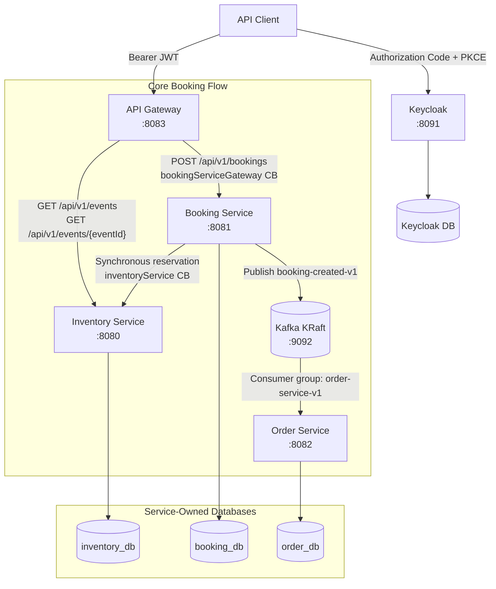

# BookMyEvent

[](https://openjdk.org/)
[](https://spring.io/projects/spring-boot)
[-black.svg)](https://kafka.apache.org/)
[](https://www.keycloak.org/)
[](https://testcontainers.com/)

BookMyEvent is an event-ticketing backend built as a suite of Spring Boot microservices. It coordinates the complete booking flow through an API Gateway, Booking, Inventory, and Order services, with Keycloak for OIDC authentication and Apache Kafka for asynchronous order materialization.

The system is designed around distributed-systems correctness: concurrency-safe inventory allocation, idempotent replays, service-owned persistence, layered circuit breaking, compensating transactions, append-only database migrations, and integration testing with real MySQL instances through Testcontainers.

**Jump to:** [Architecture](#architecture) · [Core capabilities](#core-capabilities) · [API reference](#public-api) · [Run locally](#run-locally) · [Tests](#tests) · [Design decisions](#design-decisions)

## Architecture



### Booking flow

1. **Authenticate.** The client uses OAuth 2.0 Authorization Code with PKCE to obtain a Keycloak access token.
2. **Enter through the gateway.** API Gateway validates the token's signature, expiry, issuer, and `book-my-event-api` audience before forwarding an allowlisted route.
3. **Reserve inventory.** Booking Service validates the customer, creates an immutable booking UUID, and asks Inventory Service to reserve capacity atomically.
4. **Publish or compensate.** Booking Service reports success only after Kafka acknowledges `booking-created-v1`. A publication failure triggers an idempotent capacity release and a `503 Service Unavailable` response.
5. **Materialize the order.** Order Service consumes the event using its own contract and lets a database unique key arbitrate duplicate or concurrent deliveries.

## Core capabilities

### Consistency and concurrency

- Inventory owns all capacity changes and uses database row locking to prevent overselling under concurrent requests.
- Booking and Inventory enforce a `1`–`100` ticket range; database precision guarantees that a `DECIMAL(10,2)` unit price fits safely in a `DECIMAL(12,2)` total.
- Database checks prevent negative prices or capacity, remaining capacity above the event total, and invalid ticket counts.
- Each service owns its schema, with no cross-service foreign keys or shared persistence entities.

### Resilience and compensation

- API Gateway's `bookingServiceGateway` circuit fails fast during Booking transport outages without treating Booking's valid HTTP error responses as transport failures.
- Booking Service's separate `inventoryService` circuit isolates Inventory infrastructure failures while allowing expected `404` and `409` domain outcomes through.
- Compensation releases bypass the reservation circuit so an open circuit cannot prevent cleanup.
- Booking success includes a Kafka broker acknowledgement; failed, rejected, interrupted, or timed-out publication returns `503` after a release attempt.

### Idempotency and contracts

- Inventory treats the booking UUID as an idempotency key: identical replays return the original reservation, while altered parameters return `409 Conflict`.
- Releases are idempotent and never restore capacity more than once.
- Order Service uses atomic unique-key arbitration so duplicate Kafka delivery converges on one order and conflicting data is rejected.
- HTTP DTOs and a consumer-owned, header-free event record keep persistence and Java implementation classes out of service contracts.

### Security, observability, and testing

- API Gateway exposes only event browsing and booking creation; Inventory mutation and Order endpoints remain service-local.
- Spring `ProblemDetail` provides consistent `400`, `404`, `409`, and `503` responses.
- Flyway owns append-only schema history, while Actuator exposure is limited to health, info, metrics, and circuit-breaker state.
- Integration tests cover API, persistence, migrations, security, Kafka consumption, idempotency, compensation, and concurrent capacity changes.

## Service ownership

| Service | Port | Database | Responsibility |
| --- | ---: | --- | --- |
| API Gateway | `8083` | — | JWT-protected public entry point, allowlisted routing, and fail-fast protection for Booking transport failures |
| Inventory Service | `8080` | `inventory_db` | Venues, events, available capacity, reservations, and releases |
| Booking Service | `8081` | `booking_db` | Customer validation, booking orchestration, and Kafka publication |
| Order Service | `8082` | `order_db` | Consume confirmed booking events and persist one order per booking |

No service creates a database foreign key to another service's tables. Cross-service communication uses API or event contracts instead of shared persistence entities.

## Repository structure

```text
book-my-event/
├── apigateway/           # Public HTTP routes and aggregated public API docs
├── bookingservice/       # Customer validation and booking orchestration
├── inventoryservice/     # Event inventory and reservation ownership
├── orderservice/         # Kafka consumer and idempotent order persistence
├── docker/
│   ├── keycloak/         # Importable local realm configuration
│   └── mysql/            # Database and user bootstrap script
├── docs/                 # Extended local setup documentation
├── docker-compose.yaml   # MySQL, Keycloak, Kafka, and tooling
├── .env.example          # Optional local Compose overrides
└── README.md
```

Each service is an independent Maven project with its own wrapper, application configuration, Flyway history, and test suite.

## Technology stack

- Java 25
- Spring Boot 4.1.1
- Spring Web MVC and Spring REST Client
- Spring Security OAuth 2.0 Resource Server
- Jakarta Bean Validation
- Spring Data JPA and Hibernate
- MySQL 8.4
- Keycloak 26.7.3
- Apache Kafka 4.3.0 in KRaft mode
- Confluent Schema Registry 8.3.1
- Kafbat Kafka UI 1.5.0
- Flyway
- Maven Wrapper
- JUnit 5, MockMvc, and Testcontainers
- Docker Compose

## Public API

Clients should call the gateway at `http://localhost:8083`. Every public API below requires `Authorization: Bearer <access-token>`. The service ports remain useful for local development and service-level diagnosis, but they bypass gateway authentication and are not the public client contract.

| Method | Gateway endpoint | Downstream owner | Success | Description |
| --- | --- | --- | --- | --- |
| `GET` | `/api/v1/events` | Inventory Service | `200 OK` | List events |
| `GET` | `/api/v1/events/{eventId}` | Inventory Service | `200 OK` | Retrieve one event and its venue |
| `POST` | `/api/v1/bookings` | Booking Service | `200 OK` | Validate a customer, reserve tickets, and publish the booking event |

The gateway intentionally returns `404` for Inventory venue, reservation, and release routes, as well as Order routes and unknown paths. This route allowlist does not mean that local service ports are network-firewalled; it means those endpoints are not exposed through the gateway.

### Booking request

Example request:

```json
{
  "customerId": 1,
  "eventId": 1,
  "ticketCount": 2
}
```

`customerId` and `eventId` must be positive. `ticketCount` must be between `1` and `100`; larger requests return `400 Bad Request` before Booking Service calls Inventory.

Example response:

```json
{
  "bookingId": "cfe3b7c1-6000-4e03-9f68-429ab2118b91",
  "status": "RESERVED",
  "totalPrice": 20.00
}
```

The gateway returns Booking Service's result. If the gateway cannot connect to Booking Service, repeated transport failures open `bookingServiceGateway` and booking requests receive a sanitized `503 Service Unavailable` response without waiting for another failed connection. Responses produced by Booking Service itself—including its own `503`—pass through unchanged and do not count as gateway transport failures.

Booking Service returns `RESERVED` only after Inventory confirms the reservation and Kafka acknowledges the event. If repeated Inventory infrastructure failures open the `inventoryService` reservation circuit, new booking attempts fail fast with `503 Service Unavailable`. If publication fails, Booking Service attempts to release the reservation and returns `503` instead of reporting success. Compensation releases bypass the reservation circuit so an open circuit cannot prevent cleanup.

Published `booking-created-v1` value:

```json
{
  "bookingId": "cfe3b7c1-6000-4e03-9f68-429ab2118b91",
  "customerId": 1,
  "eventId": 1,
  "ticketCount": 2,
  "totalPrice": 20.00
}
```

The Kafka record key is the same `bookingId`, which keeps messages for one booking on the same partition. The version is carried by the topic name rather than Java type headers.

## Service-local APIs

Inventory's service-local API owns the following operational endpoints. They are intentionally not public gateway routes.

| Method | Endpoint | Success | Description |
| --- | --- | --- | --- |
| `GET` | `/api/v1/inventory/events` | `200 OK` | List event inventory |
| `GET` | `/api/v1/inventory/event/{eventId}` | `200 OK` | Retrieve one event and its venue |
| `GET` | `/api/v1/inventory/venue/{venueId}` | `200 OK` | Retrieve one venue |
| `POST` | `/api/v1/inventory/reservations` | `201 Created` or `200 OK` | Create a reservation or replay an identical one |
| `PUT` | `/api/v1/inventory/reservations/{bookingId}/release` | `204 No Content` | Release a reservation idempotently |

Inventory reservation request:

```json
{
  "bookingId": "cfe3b7c1-6000-4e03-9f68-429ab2118b91",
  "eventId": 1,
  "ticketCount": 2
}
```

Inventory reservation response:

```json
{
  "bookingId": "cfe3b7c1-6000-4e03-9f68-429ab2118b91",
  "eventId": 1,
  "ticketCount": 2,
  "status": "RESERVED",
  "unitPrice": 10.00,
  "totalPrice": 20.00
}
```

The first request for a booking UUID returns `201 Created`. Replaying the same UUID, event, and ticket count returns the existing reservation with `200 OK` and does not decrement capacity again. Reusing that UUID with different reservation details returns `409 Conflict`. Inventory independently enforces the same `1`–`100` ticket range because this is an internal service boundary, not only a public API rule.

### Error behavior

| Status | Examples |
| --- | --- |
| `400 Bad Request` | Missing or non-positive IDs/counts, more than 100 tickets, malformed JSON, or invalid path parameters |
| `404 Not Found` | Customer, event, venue, or reservation does not exist |
| `409 Conflict` | Insufficient capacity or conflicting reuse of a booking UUID |
| `503 Service Unavailable` | API Gateway cannot reach Booking Service, Booking Service cannot obtain a trustworthy Inventory result, the Inventory reservation circuit is open, or Kafka does not acknowledge publication |

## Run locally

### Prerequisites

- JDK 25
- Docker Desktop or Docker Engine with Compose v2
- PowerShell, Bash, or Zsh

The examples below use PowerShell. On Linux or macOS, use `./mvnw` instead of `.\mvnw.cmd`, `cd` instead of `Set-Location`, and prefix development runs with `SPRING_PROFILES_ACTIVE=dev`.

### 1. Start local infrastructure

From the repository root:

```powershell
docker compose up -d
docker compose ps -a
```

The root Compose project starts:

- MySQL and a one-time bootstrap job that creates `inventory_db`, `booking_db`, and `order_db` with separate users.
- A separate MySQL 8.4 database for Keycloak and Keycloak at `http://localhost:8091`. On a fresh database, Keycloak imports the checked-in `book-my-event` realm, API audience, Postman client, and PKCE configuration.
- A single-node Kafka 4.3.0 cluster using KRaft instead of ZooKeeper.
- A one-time, idempotent initializer for the `booking-created-v1` topic with 3 partitions.
- Schema Registry at `http://localhost:8085`.
- Kafka UI at `http://localhost:8090`.

Wait until MySQL, Keycloak, Kafka, and Schema Registry show `healthy`; `mysql-bootstrap` and `kafka-init` should show `Exited (0)`. The successful one-time jobs intentionally stop after completing, so use `docker compose up -d` instead of `docker compose up -d --wait` with this stack. The defaults are local-development credentials; copy `.env.example` to `.env` only when you need local overrides.

On a memory-constrained machine, start the identity stack separately before the full stack:

```powershell
docker compose up -d keycloak-db keycloak
docker compose ps keycloak-db keycloak
```

Confirm the booking topic from the repository root:

```powershell
docker compose exec -T kafka `
    /opt/kafka/bin/kafka-topics.sh `
    --bootstrap-server kafka:19092 `
    --describe `
    --topic booking-created-v1
```

### 2. Create a local user and obtain a token

Open `http://localhost:8091/admin/` and sign in with the local defaults `admin` / `admin_password` unless they were overridden. These credentials are for local development only.

The imported realm deliberately contains no application users or passwords. In Keycloak:

1. Select the imported `book-my-event` realm.
2. Create an enabled fictional local user such as `demo.user`.
3. On the user's **Credentials** tab, set a password used nowhere else and turn **Temporary** off. Do not commit or share that password.

Confirm `http://localhost:8091/realms/book-my-event/.well-known/openid-configuration` returns JSON with issuer `http://localhost:8091/realms/book-my-event`.

The imported configuration includes the public `book-my-event-postman` client, Authorization Code flow with PKCE `S256`, the exact Postman callback URI, and a default audience mapper for `book-my-event-api`. For a fully manual configuration walkthrough, see [Local Keycloak and Postman setup](docs/local-keycloak-setup.md).

In Postman, use OAuth 2.0 **Authorization Code (With PKCE)** with:

| Field | Value |
| --- | --- |
| Callback URL | `https://oauth.pstmn.io/v1/browser-callback` |
| Auth URL | `http://localhost:8091/realms/book-my-event/protocol/openid-connect/auth` |
| Access Token URL | `http://localhost:8091/realms/book-my-event/protocol/openid-connect/token` |
| Client ID | `book-my-event-postman` |
| Client Secret | Leave empty |
| Scope | `openid` |
| Code Challenge Method | `SHA-256` |

Authorize using the browser, sign in as the fictional local user, and send the resulting access token as a Bearer token. Keep token sharing disabled.

### 3. Start Inventory Service

Open a new PowerShell window from the repository root:

```powershell
Set-Location .\inventoryservice
$env:SPRING_PROFILES_ACTIVE = "dev"
.\mvnw.cmd spring-boot:run
```

On an empty database, the `dev` profile creates two fictional venues and events. Inventory Service is available at `http://localhost:8080`.

### 4. Start Booking Service

Open another PowerShell window from the repository root:

```powershell
Set-Location .\bookingservice
$env:SPRING_PROFILES_ACTIVE = "dev"
.\mvnw.cmd spring-boot:run
```

On an empty database, the `dev` profile creates one fictional customer. Booking Service is available at `http://localhost:8081`.

### 5. Start Order Service

Open another PowerShell window from the repository root:

```powershell
Set-Location .\orderservice
.\mvnw.cmd spring-boot:run
```

Order Service consumes `booking-created-v1` as part of the `order-service-v1` consumer group and persists confirmed bookings in `order_db`.

### 6. Start API Gateway

After Inventory, Booking, and Order are running, open another PowerShell window from the repository root:

```powershell
Set-Location .\apigateway
$env:GATEWAY_INVENTORY_URL = "http://localhost:8080"
$env:GATEWAY_BOOKING_URL = "http://localhost:8081"
# These match the local Keycloak realm imported in step 1.
$env:KEYCLOAK_ISSUER_URI = "http://localhost:8091/realms/book-my-event"
$env:KEYCLOAK_AUDIENCE = "book-my-event-api"
# SERVER_PORT defaults to 8083; set it only when overriding the gateway port.
# $env:SERVER_PORT = "8083"
.\mvnw.cmd spring-boot:run
```

`GATEWAY_INVENTORY_URL`, `GATEWAY_BOOKING_URL`, `KEYCLOAK_ISSUER_URI`, and `KEYCLOAK_AUDIENCE` default to the local values above. Gateway `SERVER_PORT` defaults to `8083`.

On a memory-constrained workstation, close the IDE and build services sequentially with `mvnw.cmd -ntp -DskipTests package`. Run each packaged JAR with `java -Xms64m -Xmx192m -jar target/<service>-0.0.1-SNAPSHOT.jar` instead of keeping Maven and the IDE attached. Schema Registry and Kafka UI are optional during the core booking flow and can remain stopped.

### 7. Call the authenticated gateway

Use Postman to obtain an access token with the Authorization Code + PKCE settings
from step 2. You can use it in Postman or paste the short-lived token into
a PowerShell session:

```powershell
$accessToken = "<paste the access token from Postman>"

$body = @{
    customerId = 1
    eventId = 1
    ticketCount = 2
} | ConvertTo-Json

Invoke-RestMethod `
    -Method Post `
    -Uri http://localhost:8083/api/v1/bookings `
    -Headers @{ Authorization = "Bearer $accessToken" } `
    -ContentType "application/json" `
    -Body $body
```

The equivalent cURL request is:

```bash
curl -X POST http://localhost:8083/api/v1/bookings \
  -H "Authorization: Bearer <ACCESS_TOKEN>" \
  -H "Content-Type: application/json" \
  -d '{
    "customerId": 1,
    "eventId": 1,
    "ticketCount": 2
  }'
```

You can browse events through the same public entry point:

```powershell
Invoke-RestMethod `
    -Uri http://localhost:8083/api/v1/events/1 `
    -Headers @{ Authorization = "Bearer $accessToken" }
```

Inspect published records in Kafka UI at `http://localhost:8090`, or from the repository root:

```powershell
docker compose exec -T kafka `
    /opt/kafka/bin/kafka-console-consumer.sh `
    --bootstrap-server kafka:19092 `
    --topic booking-created-v1 `
    --from-beginning `
    --timeout-ms 5000
```

Verify that Order Service materialized the booking:

```powershell
docker compose exec -T -e MYSQL_PWD=order_password mysql `
    mysql -uorder_user order_db `
    -e "SELECT booking_id, customer_id, event_id, ticket_count, total_price FROM ticket_order;"
```

### 8. Stop the project

Stop each Spring Boot process with `Ctrl+C`, then run this from the repository root:

```powershell
docker compose down
```

Do not use `docker compose down -v` unless you intentionally want to delete all local database data.

## Operations and API documentation

| Component | URL | Access |
| --- | --- | --- |
| Gateway health and info | `http://localhost:8083/actuator/health`<br/>`http://localhost:8083/actuator/info` | Public |
| Gateway metrics and circuits | `http://localhost:8083/actuator/metrics`<br/>`http://localhost:8083/actuator/circuitbreakers` | Valid Bearer JWT required |
| Booking health, metrics, and circuits | `http://localhost:8081/actuator/health`<br/>`http://localhost:8081/actuator/metrics`<br/>`http://localhost:8081/actuator/circuitbreakers` | Service-local; not routed by Gateway |
| Gateway aggregated Swagger UI | `http://localhost:8083/swagger-ui.html` | Public documentation; API calls still require a token |
| Inventory Swagger UI | `http://localhost:8080/swagger-ui.html` | Service-local `public` and `internal` groups |
| Booking Swagger UI | `http://localhost:8081/swagger-ui.html` | Service-local `public` and `internal` groups |
| Kafka UI | `http://localhost:8090` | Local development |
| Schema Registry | `http://localhost:8085/subjects` | Local development |

Gateway and Booking expose deliberately small Actuator surfaces; sensitive endpoints such as `/actuator/env` are not exposed. Booking's operational endpoints bypass Gateway and need network policy or dedicated management security outside local development.

Gateway Swagger aggregates only the Inventory and Booking `public` documents. Both services must be running because Gateway proxies their service-owned definitions; otherwise the affected definition returns `500`. The public documents declare the Bearer JWT requirement, and the **Authorize** button accepts an access token for trying the protected APIs. Each service-local UI also exposes its owner's `internal` group.

## Database migrations

Flyway applies each service's SQL files under `src/main/resources/db/migration` at startup. Applied migration files are append-only; schema changes belong in a new versioned migration.

Important database guarantees include:

- Positive venue and event capacities, with reservation ticket counts constrained to the inclusive range `1`–`100`.
- Positive customer IDs, event IDs, and ticket counts in Order Service records.
- Non-negative remaining capacity, prices, and order totals.
- Remaining event capacity cannot exceed total capacity.
- Reservation booking UUIDs are unique.
- Order booking UUIDs are unique, and atomic duplicate-key arbitration makes concurrent redelivery safe without leaking a constraint failure.
- There are no cross-service database foreign keys.

## Tests

Docker Desktop must be running because the service tests create disposable MySQL 8.4 containers. On a memory-constrained workstation, run one suite at a time and stop Schema Registry, Kafka UI, Keycloak, and `keycloak-db` when those components are not under test.

Run each suite from the repository root:

```powershell
Set-Location .\inventoryservice
.\mvnw.cmd -ntp clean verify

Set-Location ..\bookingservice
.\mvnw.cmd -ntp clean verify

Set-Location ..\orderservice
.\mvnw.cmd -ntp clean verify

Set-Location ..\apigateway
.\mvnw.cmd -ntp clean verify
```

The last verified suites contain:

- Inventory Service: 24 passing tests.
- Booking Service: 45 passing tests.
- Order Service: 9 passing tests.
- API Gateway: 28 passing tests.

Coverage includes HTTP contracts, the 100-ticket API and database boundary, service orchestration, downstream error mapping, circuit configuration and open-circuit behavior, Actuator exposure and authentication, Kafka serialization and header-free deserialization, producer failure handling, consumer persistence, compensation, Flyway constraints, generated IDs, development seeders, duplicate delivery through Kafka, concurrent idempotent order creation, conflicting event detection, reservation release, concurrent overselling protection, gateway path rewriting, forwarded request/response metadata, public-document proxying, blocked internal and fallback routes, downstream URL validation, Booking transport fallback and call suppression, downstream `503` pass-through, and JWT rejection for missing, malformed, expired, invalid-signature, wrong-issuer, and wrong-audience tokens.

Gateway verification uses real HTTP integration tests with WireMock downstream services plus a local test OIDC issuer that publishes discovery metadata and signing keys. Tests send real signed JWTs through the running gateway; they do not disable security or depend on the developer's Keycloak database.

## Design decisions

| Decision | Rationale | Current trade-off |
| --- | --- | --- |
| **Each service owns its data** | Inventory, Booking, Order, and Keycloak use separate databases so persistence models can evolve independently and ownership stays explicit. | Cross-service consistency is coordinated through APIs and events rather than joins or database foreign keys. |
| **Inventory exclusively owns capacity** | The availability check and decrement run in one Inventory transaction instead of being split across services. | Booking creation has a synchronous dependency on Inventory. |
| **The database enforces concurrency invariants** | Row locking, check constraints, and unique keys prevent overselling, invalid capacity, and duplicate records even when requests race. | Correctness relies on MySQL transaction and locking semantics, which require integration testing against a real database. |
| **Ticket count is bounded by monetary precision** | The `1`–`100` limit ensures the largest `DECIMAL(10,2)` unit price always fits in a `DECIMAL(12,2)` total, with the rule enforced by both APIs and the database. | A single booking cannot contain more than 100 tickets. |
| **The booking UUID is the reservation idempotency key** | Identical Inventory replays return the original reservation, while reusing the UUID with different parameters returns `409 Conflict`. | Protection begins only after Booking Service creates the UUID; an ambiguous retry at the public endpoint can create another booking. |
| **Contracts remain service-owned** | HTTP DTOs keep JPA entities private, and Order Service consumes header-free JSON through its own `BookingCreatedEvent` record. | Contract changes require explicit mapping and compatibility work in each participating service. |
| **Flyway owns schema history** | Append-only migrations make schema changes repeatable while Hibernate validates the migrated schema instead of creating tables at runtime. | Every persistent-model change requires a corresponding migration. |
| **Kafka topics are explicit and versioned** | Automatic creation is disabled, and an idempotent initializer provisions `booking-created-v1` with a deliberate partition count. | Topic provisioning must complete before producers and consumers handle traffic. |
| **A broker acknowledgement defines booking success** | Booking Service returns `RESERVED` only after Kafka accepts the event; publication failure triggers Inventory's idempotent release operation and returns `503`. | Waiting adds latency, compensation can also fail, and direct publication retains a crash window between reservation and event delivery. |
| **Circuit breakers are scoped by failure domain** | API Gateway isolates Booking transport failures, while Booking separately isolates Inventory infrastructure failures and lets expected `404` and `409` outcomes pass through. State-changing booking requests are not retried, and compensation bypasses the reservation circuit. | Two circuits provide targeted behavior but require independent timeout, threshold, and recovery tuning. |
| **Order materialization is atomically idempotent** | MySQL's unique booking key makes concurrent identical deliveries converge on one order and rejects reused IDs carrying different immutable data. | A conflicting event is surfaced as a consumer failure instead of being silently accepted. |
| **The gateway is an authenticated allowlist** | Spring Security validates Keycloak token signature, time claims, issuer, and API audience, and the gateway routes only event browsing and booking creation. | Direct service ports must remain private, and the authenticated token subject is not currently bound to `customerId`. |
| **Errors use `ProblemDetail`** | Stable `400`, `404`, `409`, and `503` responses keep persistence details and incidental exceptions out of the client contract. | Exception-to-problem mappings must be maintained consistently across services. |
| **Public OpenAPI remains service-owned** | Inventory and Booking publish their own public documents, which the gateway aggregates without duplicating endpoint definitions. | The affected gateway document is unavailable when its downstream service is offline. |
| **Local infrastructure favors reproducibility** | The development stack uses single-node KRaft, explicit listeners, and `dev`-only seeders that leave non-empty tables untouched. | These conveniences model local development, not a production topology. |
| **Gateway forwarding uses HTTP/1.1** | Spring Boot's simple imperative client matches the current synchronous request-forwarding model. | Internal calls do not use HTTP/2 multiplexing. |
